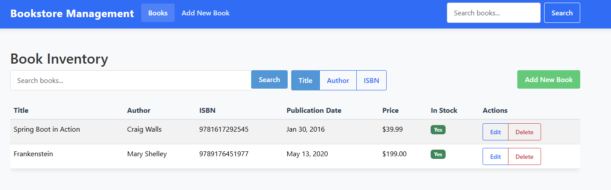

# BookstoreFrontend

A modern web application for managing book inventory. This project was generated using [Angular CLI](https://github.com/angular/angular-cli) version 19.2.8.



## Features

- Comprehensive book inventory management
- Search functionality by title, author, and ISBN
- Book details including title, author, ISBN, publication date, and price
- Stock status tracking
- Add, edit, and delete book entries
- Responsive design for mobile and desktop

## Prerequisites

Before you begin, ensure you have the following installed:
- Node.js (v18.x or later)
- npm (v9.x or later)
- Angular CLI (`npm install -g @angular/cli`)

## Installation

1. Clone the repository:
   ```bash
   git clone https://github.com/yourusername/bookstore-frontend.git
   cd bookstore-frontend
   ```

2. Install dependencies:
   ```bash
   npm install
   ```

3. Configure environment variables:
  - Copy `src/environments/environment.example.ts` to `src/environments/environment.ts`
  - Update the API endpoint and other configuration values as needed

## Development server

To start a local development server, run:

```bash
ng serve
```

Once the server is running, open your browser and navigate to `http://localhost:4200/`. The application will automatically reload whenever you modify any of the source files.

For development with a mock API, use:

```bash
ng serve --configuration=mock
```

## Code scaffolding

Angular CLI includes powerful code scaffolding tools. To generate a new component, run:

```bash
ng generate component component-name
```

For a complete list of available schematics (such as `components`, `directives`, or `pipes`), run:

```bash
ng generate --help
```

Common generators:
- Component: `ng generate component components/my-component`
- Service: `ng generate service services/my-service`
- Module: `ng generate module modules/my-module`
- Interface: `ng generate interface models/my-interface`
- Guard: `ng generate guard guards/my-guard`

## Project structure

```
src/
├── app/
│   ├── components/       # Reusable UI components
│   ├── core/             # Core functionality (http interceptors)
│   ├── models/           # TypeScript interfaces and models
│   ├── services/         # API and business logic services
│   ├── shared/           # Shared modules, pipes, directives
│   └── app.module.ts     # Main application module
├── assets/               # Static assets (images, fonts)
├── environments/         # Environment configuration
└── styles/               # Global styles and themes
```

## Building

To build the project run:

```bash
ng build
```

This will compile your project and store the build artifacts in the `dist/` directory. By default, the production build optimizes your application for performance and speed.

For a production build with specific environment:

```bash
ng build --configuration=production
```

## Running unit tests

To execute unit tests with the [Karma](https://karma-runner.github.io) test runner, use the following command:

```bash
ng test
```

To generate a code coverage report:

```bash
ng test --code-coverage
```

The coverage report will be available in the `coverage/` directory.

## Running end-to-end tests

For end-to-end (e2e) testing, run:

```bash
ng e2e
```

Angular CLI does not come with an end-to-end testing framework by default. You can choose one that suits your needs, such as Cypress or Playwright.

## Linting and code formatting

To check code quality:

```bash
ng lint
```

To automatically fix linting issues:

```bash
ng lint --fix
```

## Deployment

### Docker deployment

A Dockerfile is provided for containerized deployment:

```bash
# Build the Docker image
docker build -t bookstore-frontend .

# Run the container
docker run -p 8080:80 bookstore-frontend
```

### Static hosting

The built application can be deployed to any static hosting service:

1. Build the application: `ng build --configuration=production`
2. Upload the contents of the `dist/bookstore-frontend/` directory to your hosting provider

## Contributing

1. Fork the repository
2. Create your feature branch: `git checkout -b feature/my-new-feature`
3. Commit your changes: `git commit -am 'Add some feature'`
4. Push to the branch: `git push origin feature/my-new-feature`
5. Submit a pull request

Please make sure to update tests as appropriate and follow the Angular style guide.

## Additional Resources

- [Angular Documentation](https://angular.dev/)
- [Angular CLI Overview and Command Reference](https://angular.dev/tools/cli)
- [TypeScript Documentation](https://www.typescriptlang.org/docs/)
- [RxJS Documentation](https://rxjs.dev/guide/overview)

## License

This project is licensed under the MIT License - see the LICENSE file for details.
